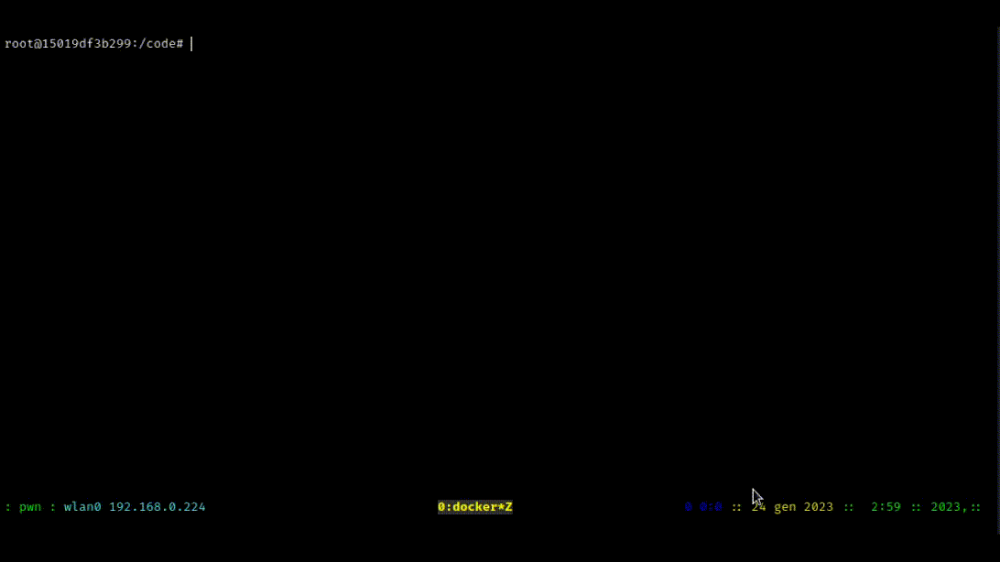
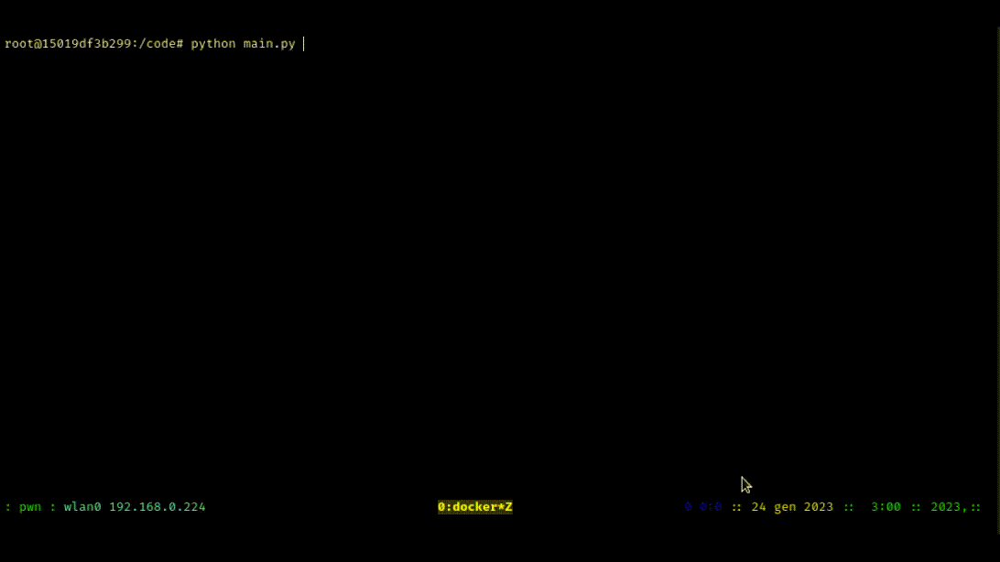

# Python project

[](https://shields.io/)

We've done the Python project #1 as described in the [specifications](https://docs.google.com/document/d/1mmYhPG4vjb1TU7clcIGrPm_9pHvX5SfLTxCrxBBhhc4/edit).

## Getting Started

Clone this repository, then enter the project directory.

```sh
git clone https://gitlab2.educ.di.unito.it/st203699/ium-hci-proj.git
cd ium-hci-proj/py/
```

Download the dataset from [Moodle](https://informatica.i-learn.unito.it/mod/resource/view.php?id=197640) and put it in the `data` directory.

Get the the latest Python version (`3.11`, currently).

```sh
docker image pull python:latest
```

Start a container to run my python scripts.
```sh
docker run -it -v `pwd`:/code/ python:latest bash
```

Go in the project directory and get the dependencies:
```sh
cd code/
pip install -r requirements.txt
```

Run the application.
```sh
cd /code/
python main.py
```

## Project specifications

1. The user choses two random words, from the wordlist or new.
2. The program finds all the words that are alphabetically close by using a set of rules / operations:

a.  **R1**: insert/delete a letter anywhere in the word: $` \texttt{pro}\to\texttt{poro}\to\texttt{porro}`$.

b.  **R2**: anagram: $`\texttt{torta}\to\texttt{trota}`$.

c. **R3**: replace a letter: $`\texttt{torta}\to\texttt{torto}`$.

The program repeats these operations and create links to two words. For example:
```math
\texttt{pro}\implies\texttt{porro}=2\cdot\mathrm{R_1}\\
\texttt{torta}\implies\texttt{trota}=\mathrm{R_2}\\
\texttt{trota}\implies\texttt{torto}=\mathrm{R_2+R_3}
```
Each operation can have a different cost. You have to find the minimum distance, which is the minimum cost of operations that transform one word into the other. We can say that these two paths are equivalent:
```math
\texttt{casa}\implies\texttt{cosmo}=3\cdot\mathrm{R_3+R_1}\\
\texttt{casa}\to\texttt{cosa}\to\texttt{coma}\to\texttt{como}\to\texttt{cosmo}\\
\texttt{casa}\to\texttt{casta}\to\texttt{costa}\to\texttt{costo}\to\texttt{cosmo}
```
The path **must** contain only words from the wordlist.

## Implementation

### First idea: Dynamic Programming Approach

All the words from the wordlist are stored in a simple `set` data structure:
```py
    words = set()
    words_file = open('data/words.italian.txt', 'r')
    for line in words_file:
        if line != '\n':
            words.add(line.strip().lower())
``` 
We've chosen to use this data structure because it doesn't allow duplicates and the implementation gives a $`O(1)`$ time complexity for accessing data.

In the *Algorithms and Data Structures (ASD)* course we have studied the *dynamic programming* and the *Longest Common Subsequence* algorithm with some example genomes as input. The LCS algorithm is able to compare two strings and evaluate their similarity only by doing insertions and deletions.

In order to find the close alphabetical words of a given string, we've decided to implement a different *dynamic programming algorithm*: the **Wagner–Fischer algorithm** which computes the **Damerau–Levenshtein distance**. This [recursive function](https://en.wikipedia.org/wiki/Damerau%E2%80%93Levenshtein_distance#Definition) returns the minimum number of operations needed to transform one word into another by using the following operations:
* Insertion (I) and deletion (D) of a character (like the LCS algorithm)
* Substitution (S) (Levenshtein distance = I+D+S)
* Transposition (T) of two consecutive characters (Damerau-Levenshtein distance= I+D+S+T)

This distance is computed **without** checking if the intermediate words resulting an operation are actually real words!!! Plus it is not perfect for this python project, since this algorithm doesn't give the correct result for these two words:

```math
\begin{aligned}
\texttt{allap}\implies\texttt{palla}&=1 &(\mathrm{R_2})\ & \ \text{for\ my\ algorithm}\\
&=2 &(\mathrm{2\cdot R_1})\  &\ \text{for Damerau-Levenshtein}
\end{aligned}
```
So, we can't use the pure Damerau-Levenshtein distance, but we have to modify it in order to detect if one word is the anagram of the other and return $`1`$ since it's a single operation. Let's see our old implementation:

```py
from collections import Counter

canAnagram :bool = lambda f,s: True if Counter(f) == Counter(s) else False

def extra_damerau_levenshtein(first :str, second :str):
	"""
	Extended Wagner-Fischer algorithm for DL distance
	"""
	dlMatrix = [[float('inf')] * (len(second) + 1) for i in range(len(first) + 1)]
	anagram_possible = False

	if canAnagram(first, second):
		anagram_possible = True
		dlMatrix[0][0] = 1

	if anagram_possible == False:
		# Base case
		for i in range(len(second) + 1):
			dlMatrix[len(first)][i] = len(second) - i
		for i in range(len(first) + 1):
			dlMatrix[i][len(second)] = len(first) - i

		# Recursive case
		for i in range(len(first) - 1, -1, -1):
			for j in range(len(second) - 1, -1, -1):
				if first[i] == second[j]:
					dlMatrix[i][j] = dlMatrix[i+1][j+1]    # NOP
				else:
					dlMatrix[i][j] = 1 + min(
								dlMatrix[i+1][j],	# deletion
								dlMatrix[i][j+1],	# insertion
								dlMatrix[i+1][j+1]	# substitution
								)
				if  i < len(first)-1 and j < len(second)-1 \
                                and first[i] == second[j+1] and first[i+1] == second[j]:
					dlMatrix[i][j] = min(
							    dlMatrix[i][j],		# previous OP
							    dlMatrix[i+2][j+2] + 1	# transposition
							    )
	return dlMatrix[0][0]

```
Now that we can get the distance between two words, it would be cool to extract from the wordlist all the alphabetically close words, and that means all the words which have a **Extra-Damerau-Levenshtein distance** equals to $`1`$! Since we also want fast code (and unfortunately we can't write this in C), we added a function that uses Python sets and simple Set theory to reduce the number of words from the wordlist that will be used by our distance algorithm:

```py
def same_letters(first :str, second :str):
    first_letters = set(first)     # Sets of letters of the 1st word
    second_letters = set(second)   # Sets of letters of the 2nd word

    if first_letters == second_letters:
        return 0
    elif first_letters.issubset(second_letters):
        return -1
    elif second_letters.issubset(first_letters):
        return 1
    elif len(second_letters-first_letters) == 1 \
    or len(first_letters - second_letters) == 1:
        return 2
    else:
        return None
```
As you can imagine by reading this code, you can still have words with a lot more letters! You can see this by running this function with the only letter `a` as first word. So we also added a lambda function to compare string lenghts:

```py
lencmp :int = lambda f,s: len(f) - len(s)
```
We are trying to implement an algorithm with a very good time complexity, this is why we are permanently checking the execution time. We have decided to leave this approach because:

- `same_letters` is $`O(n)`$: `set(first)` and `set(second)` are $`O(n)`$.
- `extra_damerau_levenshtein` is $`O(n^2)`$: it uses a matrix with the two input words.

In reality, both functions have an amortized constant time complexity because the length of the words is a very small number, but the final algorithm must call them so many times to find the correct solutions! By our testing, this approach can't give a result in reasonable time. 

### Final Idea: Graph Approach

This is the first thing you should think of when dealing with paths. We decided to implement the **Dijkstra Algorithm** with a **Directed Graph** as abstract data type. 

Since we are using Python (and this is not an Algorithm course), we are not reinventing the wheel and we are using a well known library to work with Graphs: [Networkx](https://networkx.org/). This library is far from solving the main problem with this specific exercise: **extracting as fast as possible valid dictionary words**.

In the previous approach, we looped through all the words in the dictionary and we called `same_letters` plus `extra_damerau_levenshtein` to get the words adjacent to the initial one. This was an $`O(n)`$ solution, **just for one word**. As you can imagine, finding a path with an O(n) algorithm is not a great solution, considering that you must get the adjacent words multiple times to determine a path!

We developed an algorithm with the Python's *Array slicing notation* that computes all the words you can generate with the *addition*, *deletion*, *substitution* of a character or with an *anagram*:

```py
def get_adjacencies(word :str, final :str) -> list[str]:
	# [...]
	result = []
	tuple_ang_list = []

	# add
	for i in range(len(word)+1):
		for c in string.ascii_lowercase:
			new_word = word[:i] + c + word[i:]
			if (new_word in words or new_word == final):
				result.append((new_word, add_cost, add_label))

	# del
	for i in range(len(word)):
		new_word = word[:i] + word[i+1:]
		if new_word in words or new_word == final:
			result.append((new_word, del_cost, del_label))

	# sub
	for i in range(len(word)):
		for c in string.ascii_lowercase:
			if c != word[i]:
				new_word = word[:i] + c + word[i+1:]
			if new_word in words or new_word == final:
				result.append((new_word, sub_cost, sub_label))

	# ang
	try:
		ang_list = anagrams[''.join(sorted(word))]

		if(sorted(word) == sorted(final)):
			ang_list.append(final)
		for w in ang_list:
			tuple_ang_list.append((w, ang_cost, ang_label))
		result = [*result, *tuple_ang_list]
	except KeyError:
		pass

	return result
```
Let's examine the time complexity:
* Addition: $`O(w\cdot a + n)`$, where $`w`$ is the length of the word and $`a`$ is the length of the alphabet and n is the number of accessi al dizionario che si fanno per controllare se new_word è in words.
* Deletion: $`O(w + n)`$, where $`w`$ is the length of the word.
* Substitution: $`O(w\cdot a + n)`$, where $`w`$ is the length of the word and $`a`$ is the length of the alphabet.
* Anagram: $`O(w\log(w)\cdot b + m)`$, where $`w`$ is the length of the word, $`b`$ is the length of the list of anagrams retrieved with $`m\cdot O(1)`$ operations in the `anagrams` dictionary.

With the single character operations we add $`n`$ to the complexity, which is the number of $`O(1)`$ operations in the `words` set. In the end we have $`O(w\cdot a\cdot \log(w) + n + m)`$ that can be approximated to $`O(w\cdot a\cdot \log(w))`$.

Considering that in an Italian text, the medium length of the words is `5.4` (Wikipedia), this algorithm is more than 500 times faster than the previous approach, which was $`O(n)`$, where $`n`$ was the number of words in the dictionary.

It returns an array of tuples in the format `(adjacent_word, cost_of_operation, name_of_operation)` which can be used to create edges of the graph between a word and its adjacencies.

### Suboptimal and Optimal paths

The **Networkx** library provides a function, `all_shortest_paths`, that given a graph, uses the Dijsktra algorithm to calculate all the shortest paths between two words given as parameters.

After getting the paths, we store them in a list with their cost, obtained using `get_path_cost` function. The function `all_shortest_paths` returns all the shortest paths, but we want to distinguish them by their cost. All the paths whose cost is the minimum cost are **optimal paths**, while others are considered **suboptimal paths**, which are the paths with the same number of operations as the best path but with an higher cost.

We decided to print suboptimal paths only in a short way and with their cost, while for optimal paths we added the printing of the details of every edge that composes the path, specifing the operation applied to go from a node to another one.

### Examples

Let's see if exists a path between `marino` and `segnan` with the given dictionary words:



Let's see if exists a path between `pippo` and `pluto` with the given dictionary words:



Have fun searching paths between two words... here are some other examples:
- From `cristina` to `gena`
- From `poco` to `fronti`
- From `ciao` to `mamma`
- From `forza` to `milan`
- From `messi` to `ronaldo`

## Authors

* [Filippo Bogetti](https://bogeee.github.io/)
* [Stefano Fontana](#Authors)

## License

See [LICENSE](../LICENSE.md).

